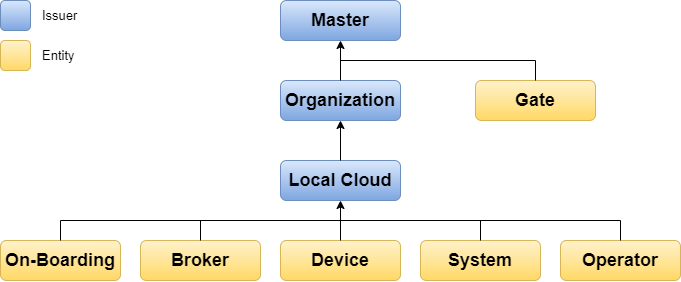

# X.509 Certificate Profiles

X.509 is a [certificate](../help/definitions.md#certificate) standard produced by the International Telecommunication Union - Telecommunication Standardization Sector (ITU-T) and is famously used by the TLS and DTLS protocols. 

## Profile Hierarchy

In brief, an X.509 [certificate](../help/definitions.md#certificate) represents the identity of its owner. It records required inputs to a secure key exchange algorithm, as well as how the identity it represents is endorsed by a hierarchy of issuers.

There are nine arrowhead certificate profiles defined and depicted in the following diagram:

The certificates must contain their profile identifiers as a Distinguished Name Qualifier (DN).

Profile | Identifier
--- | ---
Master | `ma`
Gate | `ga`
Organization | `or`
Local Cloud | `lo`
On-Boarding | `on`
Broker | `br`
Device | `de`
System | `sy`
Operator | `op`

## Master Profile

A Master certificate exists to establish trust between organizations that may want to interconnect their Arrowhead systems. It does this by issuing Organization and Gate certificates. The former enables organizations to set up their own certificate hierarchies while sharing a common CA with other organizations. The latter kind enables all those organizations to trust a special kind of relay system, which facilitates negotiating connections between organizations.

**Issuer**

May be self-signed or issued by an RFC 5280-compliant CA. 

**Subject**

The subject field DN must contain the following attributes exactly once.

Attribute Type | Value
--- | ---
Common Name (CN) | `arrowhead.eu`
DN Qualifier (DN) | `ma`

**Extensions**

The following extensions must be used and configured as described:

Extension | Critical | Value
--- | --- | ---
Authority Key Identifier | No | Hash of issuer public key. Omit field if self-signed.
Subject Key Identifier | No | Hash of subject public key.
Basic Constraints | Yes | `cA: true`, `pathLenConstraint: 2`
Key Usage | Yes | Bits `keyCertSign` and `cRLSign` must be set.

## Gate Profile

A Gate certificate is associated with a message relay or bus that exists to guarantee delivery of messages
between the local clouds of distinct organizations. Its existence means that such messages can be sent over a
secure transport.

**Issuer**

Must be issued by a Master certificate.

**Subject**

The subject field DN must contain the following attributes exactly once.

Attribute Type | Value
--- | ---
Common Name (CN) | `<relay-name>.arrowhead.eu`
DN Qualifier (DN) | `ga`

**Extensions**

The following extensions must be used and configured as described:

Extension | Critical | Value
--- | --- | ---
Authority Key Identifier | No | Hash of issuer public key.
Basic Constraints | Yes | `cA: false`
Key Usage | Yes | Bits `digitalSignature` and `keyEncipherment` must be set.
Extended Key Usage | No | Purposes `serverAuth` and `clientAuth` must be specified.
Subject Alternative Name | No | At least one IP address, DNS name or other identifier through which the system can be reached.

## Organization Profile

An Organization certificate is maintained by a single organization, allowing it to manage the certificates of their own local clouds.

**Issuer**

Must be issued by a Master certificate.

**Subject**

The subject field DN must contain the following attributes exactly once.

Attribute Type | Value
--- | ---
Common Name (CN) | `<organization-name>.arrowhead.eu`
DN Qualifier (DN) | `or`

**Extensions**

The following extensions must be used and configured as described:

Extension | Critical | Value
--- | --- | ---
Authority Key Identifier | No | Hash of issuer public key.
Subject Key Identifier | No | Hash of subject public key.
Basic Constraints | Yes | `cA: true`, `pathLenConstraint: 1`
Key Usage | Yes | Bits `keyCertSign` and `cRLSign` must be set.

If the certificate will be used to automatically respond to CSRs (Certificate Signing Request) via a network application interface, the following must also be present:

Extension | Critical | Value
--- | --- | ---
Key Usage | Yes | Bits `digitalSignature` and `keyEncipherment` must be set in addititon.
Extended Key Usage | No | Purposes `serverAuth` and `clientAuth` must be specified.
Subject Alternative Name | No | At least one IP address, DNS name or other identifier to which CSRs can be sent.

## Local Cloud Profile

A Local Cloud certificate is maintained by a single local cloud, enabling it to issue end entity certificates for on-boarding and on-boarded devices, as well as for systems and operators.

**Issuer**

Must be issued by an Organization certificate.

**Subject**

The subject field DN must contain the following attributes exactly once.

Attribute Type | Value
--- | ---
Common Name (CN) | `<cloud-name>.<organization-name>.arrowhead.eu`
DN Qualifier (DN) | `lo`

**Extensions**

The following extensions must be used and configured as described:

Extension | Critical | Value
--- | --- | ---
Authority Key Identifier | No | Hash of issuer public key.
Subject Key Identifier | No | Hash of subject public key.
Basic Constraints | Yes | `cA: true`, `pathLenConstraint: 0`
Key Usage | Yes | Bits `keyCertSign` and `cRLSign` must be set.

If the certificate will be used to automatically respond to CSRs (Certificate Signing Request) via a network application interface, the following must also be present:

Extension | Critical | Value
--- | --- | ---
Key Usage | Yes | Bits `digitalSignature` and `keyEncipherment` must be set in addititon.
Extended Key Usage | No | Purposes `serverAuth` and `clientAuth` must be specified.
Subject Alternative Name | No | At least one IP address, DNS name or other identifier to which CSRs can be sent.

## On-Boarding Profile

An On-Boarding certificate allows for a device in an Arrowhead local cloud to request a new device certificate. It is used for both, either to provide new devices and/or to facilitate renewal of certificates as they are about to
expire. Certificates adhering to this profile must only be provided to devices known or assumed to be trustworthy.

**Issuer**

Must be issued by a Local Cloud certificate.

**Subject**

The subject field DN must contain the following attributes exactly once.

Attribute Type | Value
--- | ---
Common Name (CN) | `<on-boarding-system-name>.<cloud-name>.<organization-name>.arrowhead.eu`
DN Qualifier (DN) | `on`

**Extensions**

The following extensions must be used and configured as described:

Extension | Critical | Value
--- | --- | ---
Authority Key Identifier | No | Hash of issuer public key.
Basic Constraints | Yes | `cA: false`
Key Usage | Yes | Bits `digitalSignature` and `keyEncipherment` must be set.
Extended Key Usage | No | Purposes `serverAuth` and `clientAuth` must be specified.
Subject Alternative Name | No | At least one IP address, DNS name or other identifier through which the owning device can be reached.

## Device Profile

A Device certificate allows for a device in an Arrowhead local cloud to request new system certificates. One system certificate is required for each system a given device intends to run. Certificates adhering to this profile
must only be provided to devices known or assumed to be trustworthy.

**Issuer**

Must be issued by a Local Cloud certificate.

**Subject**

The subject field DN must contain the following attributes exactly once.

Attribute Type | Value
--- | ---
Common Name (CN) | `<device-name>.<cloud-name>.<organization-name>.arrowhead.eu`
DN Qualifier (DN) | `de`

**Extensions**

The following extensions must be used and configured as described:

Extension | Critical | Value
--- | --- | ---
Authority Key Identifier | No | Hash of issuer public key.
Basic Constraints | Yes | `cA: false`
Key Usage | Yes | Bits `digitalSignature` and `keyEncipherment` must be set.
Extended Key Usage | No | Purposes `serverAuth` and `clientAuth` must be specified.
Subject Alternative Name | No | At least one IP address, DNS name or other identifier through which the device can be reached.

## Broker Profile

A Broker certificate is associated with a message broker that exists to guarantee delivery of messages between the systems within a Local Cloud when secured publish-subscribe
communication strategy is required (like MQTT protocol).

**Issuer**

Must be issued by a Local Cloud certificate.

**Subject**

The subject field DN must contain the following attributes exactly once.

Attribute Type | Value
--- | ---
Common Name (CN) | `<broker-name>.<cloud-name>.<organization-name>.arrowhead.eu`
DN Qualifier (DN) | `br`

**Extensions**

The following extensions must be used and configured as described:

Extension | Critical | Value
--- | --- | ---
Authority Key Identifier | No | Hash of issuer public key.
Basic Constraints | Yes | `cA: false`
Key Usage | Yes | Bits `digitalSignature` and `keyEncipherment` must be set.
Extended Key Usage | No | Purposes `serverAuth` and `clientAuth` must be specified.
Subject Alternative Name | No | At least one IP address, DNS name or other identifier through which the system can be reached.

## System Profile

A System certificate allows for a device in an Arrowhead local cloud to provide the services associated with a
particular system, and/or to act as a service consumer.

**Issuer**

Must be issued by a Local Cloud certificate.

**Subject**

The subject field DN must contain the following attributes exactly once.

Attribute Type | Value
--- | ---
Common Name (CN) | `<system-name>.<cloud-name>.<organization-name>.arrowhead.eu`
DN Qualifier (DN) | `sy`

**Extensions**

The following extensions must be used and configured as described:

Extension | Critical | Value
--- | --- | ---
Authority Key Identifier | No | Hash of issuer public key.
Basic Constraints | Yes | `cA: false`
Key Usage | Yes | Bits `digitalSignature` and `keyEncipherment` must be set.
Extended Key Usage | No | Purposes `serverAuth` and `clientAuth` must be specified.
Subject Alternative Name | No | At least one IP address, DNS name or other identifier through which the system can be reached.

## Operator Profile

An Operator certificate allows for a human or computer operator to administer a particular Arrowhead Local
Cloud.

**Issuer**

Must be issued by a Local Cloud certificate.

**Subject**

The subject field DN must contain the following attributes exactly once.

Attribute Type | Value
--- | ---
Common Name (CN) | `<operator-name>.<cloud-name>.<organization-name>.arrowhead.eu`
DN Qualifier (DN) | `sy`

**Extensions**

The following extensions must be used and configured as described:

Extension | Critical | Value
--- | --- | ---
Authority Key Identifier | No | Hash of issuer public key.
Basic Constraints | Yes | `cA: false`
Key Usage | Yes | Bits `digitalSignature` and `keyEncipherment` must be set.
Extended Key Usage | No | Purposes `serverAuth` and `clientAuth` must be specified.
Subject Alternative Name | No | At least one IP address, DNS name or other identifier through which the system can be reached.